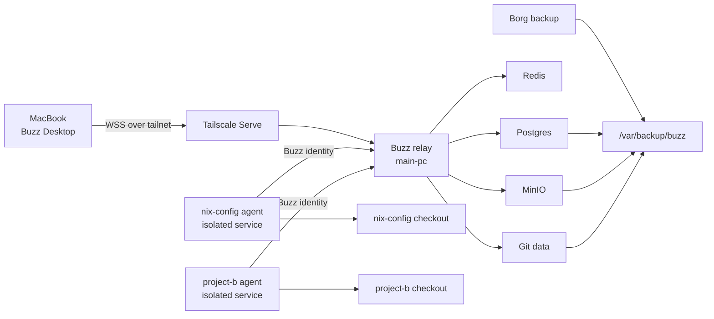

# Buzz Nixification Proposal

Status: proposal for review

Date: 2026-07-23

Scope: private personal deployment and project-scoped coding agents

## Executive Summary

Buzz is a promising fit for a personal, Discord-like workspace where persistent
human and agent identities collaborate in project rooms. The useful product
model is not "replace GitHub." It is:

- One private community for normal projects.
- One channel or channel group per project.
- Persistent agent identities that can be mentioned like teammates.
- Threads that retain plans, patches, verification, reviews, and decisions.
- Fleet machines that provide isolated execution environments behind the
  conversational surface.

The recommended first implementation is deliberately conservative:

1. Run the official Buzz relay image and its required services on `main-pc`.
2. Let NixOS own configuration, secrets, lifecycle, private routing, and
   backups.
3. Expose the relay only through Tailscale Serve.
4. Install the macOS desktop client manually for the initial trial.
5. Package the agent-facing Rust binaries only after the relay and client
   experience proves useful.
6. Run each project agent with an execution boundary separate from its Buzz
   identity.

Do not initially build the entire Rust and Tauri monorepo as one Nix package.
The official OCI image is the most stable upstream integration boundary for
the server. Native Nix packages make more sense later for `buzz-acp`,
`buzz-agent`, `buzz-dev-mcp`, and `buzz-cli`.

## Goal

Create a private workspace that feels closer to Discord than to a CI dashboard:

```text
Max's Workshop
├── #inbox
├── #agent-lounge
├── #homelab-ops
├── projects/
│   ├── #nix-config
│   ├── #project-a
│   └── #project-b
└── reviews/
    ├── #architecture
    └── #shipping
```

A representative workflow should be:

1. Mention an implementation agent in `#nix-config`.
2. The agent works in an isolated checkout associated with that project.
3. It posts its plan, progress, patch, and verification results into a thread.
4. A review agent is mentioned manually or by workflow.
5. The review and any revisions stay attached to the original work.
6. A human approves publishing, pushing, or merging.

The channel should become durable project memory, not merely a command entry
box.

## Why Buzz Fits

Buzz uses one signed event model for messages, reactions, workflows, approvals,
Git activity, humans, and agents. That is a strong substrate for agent-heavy
work because it provides:

- Persistent attribution for both humans and agents.
- Searchable project history.
- A common place for conversation, evidence, and execution status.
- Event-driven automation without reducing agents to hidden cron jobs.
- ACP and MCP boundaries instead of a single proprietary agent runtime.
- A self-hosted relay rather than a hosted-only control plane.

The implementation is substantive rather than a UI concept. The repository
contains a Rust relay, desktop and web clients, Git hosting, search, workflow
support, CLI tooling, ACP integration, agent tooling, and deployment assets.

The project is also extremely young and fast-moving. As of 2026-07-23:

- The repository was created in March 2026.
- It had approximately 5,400 stars and more than 1,700 commits.
- The latest desktop release was `v0.4.23`.
- The relay is versioned independently from the desktop.
- The latest stable relay tag visible during this review was `relay-v0.2.0`.
- Only `main` receives active security support; previous releases are
  best-effort.

The velocity is evidence of serious investment, but not evidence of stability.

## Important Security Distinction

Buzz identity and operating-system authority are different security layers.

Buzz can decide:

- Which community an identity belongs to.
- Which channels an identity can discover.
- Which channel messages an identity can read or write.
- Which signed events and audit records belong to an action.

Buzz identity does not by itself decide:

- Which files a local shell can read.
- Which repositories a process can modify.
- Which SSH agent, tokens, or environment variables it can use.
- Which hosts it can reach.
- Whether it can invoke destructive commands.

The upstream agent design explicitly says the shell runs at the operator's
trust level. Therefore, "agent is only a member of this channel" must never be
treated as equivalent to "agent can only modify this project."

The target model needs both layers:

| Layer | Responsibility |
| --- | --- |
| Buzz identity and channel membership | Conversation visibility, attribution, and workspace actions |
| Unix user, container, or VM | Filesystem and process isolation |
| Scoped credentials | Git, APIs, infrastructure, and secret access |
| Human approval | Irreversible or high-impact external actions |
| Audit and backups | Investigation and recovery |

## Recommended Architecture



The relay is the communication and coordination plane. Fleet machines and
isolated services are the execution plane.

## What Nix Should Own

| Component | Recommended owner |
| --- | --- |
| Relay image reference | Nix, pinned by immutable OCI digest |
| Postgres, Redis, and MinIO topology | Nix-generated Compose configuration |
| Service lifecycle | systemd unit generated by NixOS |
| Application secrets | sops-nix |
| Relay port and private hostname | `lib/homelab.nix` |
| TLS and tailnet exposure | existing Tailscale Serve module |
| Application-consistent exports | NixOS backup service/hook |
| Borg retention and off-host copy | existing Borg module |
| Desktop installation | manual initially; Homebrew cask later |
| Agent binaries | future Nix derivation from a pinned Buzz source revision |
| Agent execution restrictions | systemd hardening, dedicated users, containers, or fleet VMs |

## Phase 1: Private Relay on `main-pc`

### Proposed files

- `homelab/buzz.nix`
- `homelab/default.nix`
- `lib/homelab.nix`
- `secrets/secrets.yaml`
- `modules/services/backup.nix`
- Optional regression tests under `tests/`

No custom source package is required for the first server deployment.

### Runtime choice

Use the official `ghcr.io/block/buzz` image. The upstream image includes:

- `buzz-relay`
- `buzz-admin`
- `buzz-pair-relay`
- The web bundle
- The admin web bundle
- Git and the runtime dependencies required by the relay

The relay image is multi-architecture and is built separately from desktop
releases. Upstream publishes:

- `:main`
- `:sha-<short commit>`
- Relay-specific semantic versions from `relay-v*` tags

Never deploy mutable `:main` directly. Record both the source revision and OCI
digest in the Nix module.

Two reasonable pinning choices exist:

1. Pin the most recent stable relay version for lower churn.
2. Pin the `sha-*` image corresponding to the chosen desktop release for closer
   feature alignment.

During this review, desktop `v0.4.23` corresponded to commit `acfbb1b`, whose
multi-architecture relay image resolved to:

```text
sha256:29fe13981a726fe43642fe03cbd6cc87142579a90bbf9897e3c1b370d1037428
```

The stable relay `0.2.0` image resolved to:

```text
sha256:a0f67203d71d15d237fa7517788799957c30c8acdb81cbcff711e07e951c2710
```

These values are review-time evidence, not a permanent selection. Re-resolve
and verify the desired pin immediately before implementation.

### Compose versus native NixOS services

For the first iteration, preserve the topology upstream actively tests:

- Buzz relay
- Postgres 17
- Redis 7
- MinIO
- Persistent Git storage

Generate the Compose YAML from Nix rather than copying a mutable upstream file.
`pkgs.formats.yaml` can render a reviewed attrset into an immutable store path.
A NixOS systemd unit can then run the existing Docker Compose v2 installation.

Benefits:

- Keeps upstream service assumptions intact.
- Retains health checks and dependency ordering.
- Avoids coupling Buzz to the existing shared homelab PostgreSQL instance.
- Makes removal and rollback straightforward.
- Avoids compiling a large Rust/Node/Tauri workspace before the product is
  proven useful.

The stricter alternative is `virtualisation.oci-containers` with each
dependency expressed as a NixOS container. That is more natively declarative,
but it would require recreating Compose health-based startup behavior and
network setup. It offers little benefit for the first trial.

### NixOS service shape

`homelab/buzz.nix` should define:

- A generated Compose file.
- A sops-generated environment file.
- A `buzz.service` systemd unit.
- Startup ordering after Docker and network readiness.
- `ExecStart` using `docker compose up --wait`.
- `ExecStop` using `docker compose stop`.
- Restart behavior for failed startup.
- A health check against the relay readiness endpoint.
- Assertions that Docker and Tailscale are enabled.

The service should not silently follow new images. Image updates should be
explicit configuration changes.

### Networking

Add Buzz to the existing private service inventory:

```nix
privateServices.buzz.port = 19003;
```

The relay should bind only to:

```text
127.0.0.1:19003
```

The existing Tailscale Serve module can then expose:

```text
https://buzz.tail7161c3.ts.net
wss://buzz.tail7161c3.ts.net
```

The precise hostname should derive from the existing tailnet domain option.

Do not initially:

- Add Cloudflare Tunnel ingress.
- Open a public firewall port.
- Run upstream Caddy.
- Bind Postgres, Redis, MinIO, or their admin interfaces to the LAN.

Tailscale Serve already supplies private TLS termination and WebSocket
forwarding.

### Secrets

The deployment needs stable values for at least:

- Relay owner public key
- Relay private key
- Git hook HMAC secret
- Postgres password
- Redis password
- S3/MinIO access key
- S3/MinIO secret key

Use individual sops secrets and render the application environment using
`sops.templates`. Do not place plaintext values in:

- The Nix store
- The generated Compose YAML
- Git
- A world-readable environment file

The generated environment file should be root-readable and included in
relevant `restartUnits`.

Container environment variables remain visible to root and members of the
Docker group through Docker inspection. This is an existing consequence of
the Docker deployment model and should be documented.

### State

State requiring backup includes:

- PostgreSQL database
- MinIO media
- Git repositories
- Redis only if its state becomes semantically important

The state may live in named Docker volumes, but `/var/lib/docker` is
intentionally excluded from the existing Borg job. Raw inclusion of that
directory would also be a poor restore format.

Prefer an application-level export beneath:

```text
/var/backup/buzz
```

### Backup behavior

The backup workflow should:

1. Record whether the Buzz relay is running.
2. Stop the relay so new writes cannot arrive.
3. Produce a logical PostgreSQL dump.
4. Snapshot or export the MinIO media and Git volumes.
5. Restart the relay if it was previously running.
6. Leave the export beneath `/var/backup/buzz`.
7. Let the existing Borg job archive that directory.
8. Restore services even when an export or Borg step fails.

A restore drill should validate more than the presence of files:

- Restore the PostgreSQL dump into a clean database.
- Restore Git and media data.
- Start the pinned relay version against the restored state.
- Authenticate a test identity.
- Open a channel and retrieve historical messages.
- Verify a Git repository and a media object.

## Phase 2: Desktop Client

The primary human client should run on `macbook-pro-m1`.

For the trial, manually install the signed upstream Apple Silicon DMG. This
avoids building a packaging system before confirming the client is useful.

This repository's ownership convention says macOS GUI applications belong to
Homebrew casks, not Nix packages. Therefore, the eventual declarative route
should be:

1. Use an upstream Homebrew cask if Block publishes one.
2. Otherwise create or contribute a cask named something like `block-buzz`.
3. Add that cask to `users/maxpw/darwin.nix`.

The generic Homebrew token `buzz` is already used by an unrelated
transcription application, so a distinct token is required.

The client should connect to the Tailscale URL and should not need direct
access to any database, object store, or host port.

## Phase 3: Agent Tooling

The relay image does not contain the complete agent harness. Package the
agent-facing Rust binaries separately from a pinned Buzz source revision:

- `buzz-acp`
- `buzz-agent`
- `buzz-dev-mcp`
- `buzz-cli`

A single derivation may build several related binaries from the same vendored
Cargo dependency graph. The first attempt should use
`rustPlatform.buildRustPackage` and build only the required workspace packages.
Do not include the desktop or Node workspace unless a binary actually requires
it.

Possible package file:

```text
packages/buzz-agent-tools.nix
```

If added, expose it consistently through:

- The custom overlay in `flake.nix`
- Relevant `packages.<system>` outputs
- `Makefile` package update coverage, if `nix-update` can maintain it
- `.github/workflows/update-packages.yml`, if suitable for automation

### Agent identity model

Use persistent identities by role and trust boundary rather than one universal
agent key:

- `codex-builder`
- `fable-reviewer`
- `claude-designer`
- `main-pc-operator`
- Project-specific identities for sensitive repositories

Reusing the same identity across multiple ordinary project channels may be
convenient. Reusing one highly privileged execution identity across unrelated
projects is not.

### Per-project service model

A future NixOS or Home Manager module could express instances conceptually as:

```nix
custom.buzz.agents.nix-config = {
  runtime = "codex";
  repository = "/home/maxpw/nix-config";
  keyFile = config.sops.secrets.buzz-agent-nix-config.path;
};
```

The exact option schema should follow the real `buzz-acp` configuration after
the first manual harness test. Do not design a large abstraction before
observing how agents reconnect, map channels to repositories, and manage
sessions.

Each unattended agent should have:

- Its own key.
- A dedicated user, container, or VM.
- A single writable project checkout where practical.
- No inherited SSH agent.
- Explicit Git credentials.
- Explicit environment variables.
- CPU, memory, process, and runtime limits.
- Restart limits to prevent crash loops.
- Logs retained independently from Buzz messages.

Useful systemd hardening may include:

- `NoNewPrivileges=true`
- `PrivateTmp=true`
- `ProtectSystem=strict`
- `ProtectHome=read-only` or `true`
- Narrow `ReadWritePaths`
- `RestrictAddressFamilies`
- `SystemCallFilter`
- `MemoryMax`
- `CPUQuota`
- `TasksMax`
- `RuntimeMaxSec` where a continuously running harness is not required

Hardening must be tested against real Codex, Claude, Git, and MCP behavior.
Options should not be copied blindly if they break required subprocesses or
network access.

## Community and Project Boundaries

Start with one private Buzz community for normal work.

Advantages:

- One place to see presence and activity.
- Persistent relationships with agent identities.
- Cross-project DMs and shared review rooms.
- Less operational overhead.
- Easier discovery and onboarding.

Use project channels and channel membership as the normal context boundary.

Use a separate community or relay when projects require actual infrastructure
or secret isolation, for example:

- Work and personal projects with incompatible policies.
- A production-operations workspace.
- Third-party collaborators who should not discover normal community state.
- Experiments using untrusted agents or credentials.

The community boundary should not replace process isolation, and process
isolation should not be expected to provide conversation privacy.

## Recommended Initial Agent Workflow

The first useful workflow should be intentionally small:

1. A human posts a bounded task in a project channel.
2. An implementation agent acknowledges it and posts a short plan.
3. The agent edits only its assigned checkout.
4. It runs the smallest relevant verification.
5. It posts the patch summary and verification result.
6. A review agent examines the change.
7. The implementation agent addresses actionable review feedback.
8. A human decides whether to publish or merge.

Do not begin with:

- Autonomous production deployments.
- Automatic merge on reaction.
- Agents with broad homelab credentials.
- Long-running recursive orchestration.
- A universal agent allowed in every channel and repository.

## Known Upstream Risks

The following were documented gaps at review time:

- No production rate limiter is implemented.
- Workflow approval gates are not wired end-to-end.
- Some workflow actions remain stubs.
- Channel membership is the primary workspace authorization gate.
- NIP-42 authentication currently grants all known API scopes.
- The audit log is tamper-evident, not tamper-resistant against a database
  administrator who can rewrite and recompute the chain.
- Previous releases do not receive a maintained long-term support branch.
- The desktop and relay move on independent release cadences.

Operational consequences:

- Keep the first relay private to the tailnet.
- Do not rely on Buzz approval workflows as the sole safety control.
- Keep external write actions human-approved.
- Pin versions explicitly.
- Expect migrations and configuration changes.
- Test backup restoration before accumulating important project history.

## Alternatives Considered

### Build everything natively with Nix

Not recommended initially.

Advantages:

- Full build reproducibility.
- No runtime container pull.
- Potentially stronger systemd sandbox integration.

Disadvantages:

- Large Rust workspace.
- Rust toolchain version requirements.
- Tauri, Node, pnpm, and desktop dependencies.
- Fast upstream churn.
- Considerable packaging effort before validating product usefulness.

Revisit only after the relay and agent workflow prove valuable.

### Use native NixOS Postgres, Redis, and MinIO

Plausible later, but not preferred for the first deployment.

Advantages:

- Better integration with NixOS service modules.
- Easier native metrics and backup hooks.
- Less container state.

Disadvantages:

- Couples Buzz to existing homelab services.
- Requires translating and maintaining upstream assumptions.
- Authentication and socket/network boundaries become custom integration
  work.
- Makes upstream troubleshooting instructions less directly applicable.

### Use upstream Compose unchanged

Fast but insufficiently declarative.

Problems:

- Defaults to a mutable relay image.
- Uses a plaintext `.env` workflow.
- Does not integrate with sops, Borg, Tailscale Serve, or the homelab service
  inventory.
- Its public Caddy option is unnecessary here.

The proposed design preserves the topology while letting Nix own configuration
and policy.

### Expose Buzz through Cloudflare Tunnel

Not recommended initially because:

- Rate limiting is incomplete.
- The deployment is pre-1.0.
- The intended first users and agents already share a tailnet.
- Public exposure provides no benefit for the initial personal workspace.

### Create one community per project

Not recommended as the default. It weakens the Discord-like experience and
adds identity, discovery, and operations overhead. Reserve multiple communities
for real trust boundaries.

## Update Strategy

Treat relay, desktop, and agent tools as independently pinned components.

For each update:

1. Read upstream release notes and known issues.
2. Resolve the immutable OCI digest or source revision.
3. Update the declared pin.
4. Validate configuration without switching.
5. Export a current Buzz backup.
6. Deploy.
7. Verify login, history, one agent interaction, Git access, and media access.
8. Retain a rollback generation and the prior image pin.

Do not automatically advance a `main` tag on the homelab.

## Acceptance Criteria for the First Slice

The relay deployment is successful when:

- `nix flake check --no-build` passes.
- `main-pc` evaluates and builds.
- Buzz binds only to the selected loopback port.
- The relay is reachable through its Tailscale Serve hostname.
- Postgres, Redis, and MinIO are not exposed on the LAN.
- Secrets are absent from the Nix store and Git diff.
- The macOS client can authenticate and reconnect after restart.
- Two test identities can communicate in a private project channel.
- A non-member cannot discover or subscribe to that private channel.
- A relay restart preserves messages, membership, Git data, and media.
- A backup export completes and is included in Borg.
- A clean restore drill recovers a representative channel, Git repository, and
  media object.

The agent slice is successful when:

- A project agent receives a mention in the correct channel.
- It works only in its assigned checkout.
- It posts progress and a verified result back to the originating thread.
- It cannot read another protected project checkout.
- It does not inherit a broad SSH agent or unrelated secrets.
- A reviewer identity can inspect the result without gaining implementation
  credentials.
- Publishing or merging remains human-controlled.

## Questions for a Second Opinion

1. Is a Nix-generated Compose stack the right first boundary, or is
   `virtualisation.oci-containers` worth the additional startup and networking
   work?
2. Should the pilot use the stable relay tag or a digest matching the selected
   desktop release?
3. Is one private community with project channels the right trust model, or
   should sensitive projects use separate relays immediately?
4. Should Postgres, Redis, and MinIO remain isolated containers permanently, or
   migrate to native NixOS services after the pilot?
5. Is an application-level export under `/var/backup/buzz` sufficient, and
   what exact MinIO/Git restore format should be standardized?
6. Should the agent harness run on `main-pc`, dedicated fleet machines, or
   disposable VMs?
7. What minimum systemd/container restrictions preserve Codex and Claude
   functionality while enforcing useful project isolation?
8. Should persistent agent identities be role-based, project-based, or both?
9. Is manual desktop installation acceptable for the pilot, followed by an
   upstream `block-buzz` Homebrew cask?
10. Which actions must always require human approval even after upstream
    workflow approval gates become functional?

## Upstream Sources

- [Buzz repository and README](https://github.com/block/buzz)
- [Architecture and verified known limitations](https://github.com/block/buzz/blob/main/ARCHITECTURE.md)
- [Security policy and security design](https://github.com/block/buzz/blob/main/SECURITY.md)
- [Agent and MCP design](https://github.com/block/buzz/blob/main/VISION_AGENT.md)
- [Production Compose deployment](https://github.com/block/buzz/blob/main/deploy/compose/README.md)
- [Production Compose environment example](https://github.com/block/buzz/blob/main/deploy/compose/.env.example)
- [Relay image Dockerfile](https://github.com/block/buzz/blob/main/Dockerfile)
- [Relay image publishing and versioning](https://github.com/block/buzz/blob/main/.github/workflows/docker.yml)
- [Desktop releases](https://github.com/block/buzz/releases)
